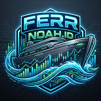
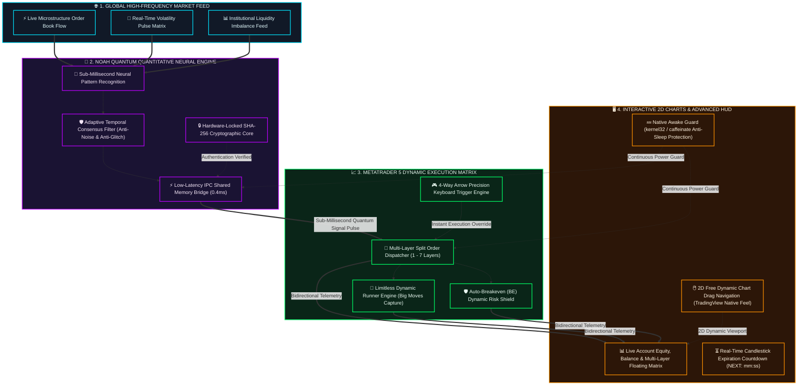

<div align="center">

# ⚡ NOAH ENGINE TRADE (NET) V5.2
### *Next-Generation Autonomous Quantitative Trading & Neural Execution Architecture*

[](https://github.com/dferdiantnn/NoahEngineTrade)
[-0078D7?style=for-the-badge&logo=windows&logoColor=white)](https://github.com/dferdiantnn/NoahEngineTrade)
[](https://github.com/dferdiantnn/NoahEngineTrade)
[](https://github.com/dferdiantnn/NoahEngineTrade)
[](https://github.com/dferdiantnn/NoahEngineTrade)
[](https://github.com/dferdiantnn/NoahEngineTrade)

<p align="center">
  
</p>

<p align="center">
  <b>Sistem Trading Kuantitatif Cerdas Berakurasi Tinggi dengan Eksekusi Multi-Layer Dinamis, Navigasi Grafik 2D Bebas, & Proteksi Keamanan Kriptografi Tingkat Lanjut.</b>
</p>

[✨ Fitur Unggulan](#-fitur-unggulan-revolusioner) • [🏗️ Arsitektur Sistem](#-arsitektur-alur-kerja-kuantitatif) • [🎮 Kontrol Hotkeys](#-kontrol-presisi-4-arah-keyboard) • [💻 Panduan Instalasi](#-panduan-instalasi--penggunaan-multi-os) • [🔑 Lisensi & Kontak](#-aktivasi-lisensi--kontak-resmi)

---

</div>

## 🌌 Tentang Noah Engine Trade (NET)

**Noah Engine Trade (NET)** adalah ekosistem trading algoritmik mutakhir yang dibangun dengan menggabungkan **analisis komputasi kuantitatif berkecepatan tinggi**, **microstructure pattern recognition**, dan **manajemen risiko multi-layer proporsional** pada platform **MetaTrader 5 (MT5)**.

Ditenagai oleh arsitektur *Sub-Millisecond Inter-Process Communication (IPC)*, NET menjembatani pemrosesan neural kuantitatif secara instan langsung ke pasar modal, memberikan eksekusi presisi tanpa latensi dengan dashboard Heads-Up Display (HUD) yang sangat interaktif.

---

## ✨ Fitur Unggulan Revolusioner

```
┌──────────────────────────────────────────────────────────┐
│  # NOAH TRADING ENGINE V5.2                  [ LIFETIME ]│
├──────────────────────────────────────────────────────────┤
│  STATUS       : # BUY  (0.06 Lot / 6 Layers)             │
│  ENTRY AVG    : [AUTO] 4487.44  │  QUANT: 4487.69        │
│  FLOATING PnL : +$1.68 USD  (+27 Pips)                   │
│  EQUITY LIVE  : $388.79 USD  (Bal: $387.11)              │
├──────────────────────────────────────────────────────────┤
│  LAYER BREAKDOWN:                                        │
│  #1 [A] SL:605p TP:RUN(MAX) Profit: +$0.27 USD           │
│  #2 [A] SL:605p TP:994p     Profit: +$0.27 USD           │
│  #3 [A] SL:605p TP:794p     Profit: +$0.27 USD           │
│  #4 [A] SL:605p TP:594p     Profit: +$0.27 USD           │
│  #5 [A] SL:605p TP:394p     Profit: +$0.27 USD           │
│  #6 [A] SL:600p TP:200p     Profit: +$0.27 USD           │
├──────────────────────────────────────────────────────────┤
│  AUTO-BE: [ON] │ MAN: 0  │ AUT: 6  │ NEXT: 06:51         │
└──────────────────────────────────────────────────────────┘
```

### 🧠 1. Multi-Layer Split Execution & Dynamic Runners
- **Manajemen Risiko Bertingkat**: Setiap order dipecah secara matematis ke dalam 1 hingga 7 layer dengan target Take Profit (TP) berjenjang dan 1 layer terakhir sebagai **Runner Tanpa Batas** untuk menangkap reli tren panjang (Big Moves).
- **Auto-Breakeven Dinamis (BE)**: Mengunci posisi saat harga telah mencapai target pips tertentu, menjamin transaksi bebas risiko (*Risk-Free Trade*).

### 🖱️ 2. Dynamic 2D Free Chart Navigation (TradingView Experience)
- **Geser Grafik 4 Arah**: Anda dapat mengklik kiri dan menggeser grafik candlestick chart MT5 ke **Atas, Bawah, Kiri, dan Kanan** secara bebas dan fleksibel.
- **Spacebar Auto-Fit Reset**: Cukup tekan tombol **Spasi (`Space`)** atau huruf **`R`** pada keyboard untuk mengembalikan skala vertikal grafik ke posisi normal secara instan.

### 📊 3. Live Equity & Next Candle Countdown HUD
- **Real-Time Account Matrix**: Menampilkan modal ekuiti berjalan, saldo balance, dan status floating profit/loss per layer secara transparan.
- **Candle Timer (`NEXT: mm:ss`)**: Menghitung mundur sisa detik penutupan candlestick aktif langsung pada panel HUD dashboard.
- **Standby Analytics**: Menampilkan histori hasil profit/loss dari transaksi terakhir saat tidak ada posisi yang berjalan.

### 🔐 4. Cryptographic License Protection (SHA-256)
- Setiap instalasi dilindungi oleh serial key kriptografi yang dikunci khusus ke nomor akun MT5 pengguna dan masa aktif lisensi (30 Hari, 60 Hari, 90 Hari, 1 Tahun, hingga Lifetime).

---

## 🏗️ Arsitektur Alur Kerja Kuantitatif



---

## 🎮 Kontrol Presisi 4 Arah Keyboard

| Tombol Keyboard | Aksi Sistem | Keterangan & Perilaku |
| :---: | :--- | :--- |
| ⬆️ **Panah Atas (Up)** | **Instant BUY Multi-Layer** | Eksekusi instan split order Buy manual dengan layer proporsional |
| ⬇️ **Panah Bawah (Down)** | **Instant SELL Multi-Layer** | Eksekusi instan split order Sell manual dengan layer proporsional |
| ⬅️ **Panah Kiri (Left)** | **Close All MANUAL Orders** | Menutup seluruh order Manual (`[M]`) tanpa mengganggu order Auto Engine |
| ➡️ **Panah Kanan (Right)** | **Close All AUTO Orders** | Menutup paksa seluruh order Auto Engine (`[A]`) secara seketika |
| ␣ **Spasi / Huruf R** | **Reset Chart Scale** | Mengembalikan skala vertikal grafik chart ke Auto-Fit standar MT5 |

---

## 💻 Panduan Instalasi & Penggunaan (Multi-OS)

Sistem ini terdiri dari **Expert Advisor MT5 (`Manager.ex5`)** dan **Quantitative Engine Runtime (`noah_runtime.py`)**.

---

### 🪟 A. Panduan Pengguna WINDOWS

#### 1. Persiapan:
- Pastikan **MetaTrader 5 (MT5)** sudah terpasang dan login ke akun trading Anda.
- Instal Python 3.10+ dari [python.org](https://www.python.org/downloads/) *(Centang "Add Python to PATH")*.

#### 2. Pemasangan EA di MT5:
1. Buka MetaTrader 5 $\rightarrow$ Menu **File** $\rightarrow$ **Open Data Folder**.
2. Masuk ke folder `MQL5` $\rightarrow$ `Experts` $\rightarrow$ buat folder `manager` $\rightarrow$ salin file `mql5/Manager.ex5` ke dalamnya.
3. Buka chart **XAUUSD (Gold)** timeframe **M15**.
4. Drag `Manager` dari panel *Navigator* ke chart.
5. Pada tab **Umum (Common)**, centang **Izinkan Trading Algo (Allow Algo Trading)**.
6. Pada tab **Masukan (Inputs)**, masukkan **Serial Key Lisensi** Anda di baris `InpLicenseKey`. Klik **OK**.
7. Pastikan tombol **Trading Algo** di toolbar atas MT5 menyala **Hijau**.

#### 3. Menjalankan Engine Runtime:
1. Buka Command Prompt (CMD) / PowerShell:
   ```cmd
   cd C:\path\ke\NoahEngineTrade
   python engine/noah_runtime.py
   ```
2. Engine kuantitatif akan langsung tersinkronisasi dengan MT5!

---

### 🍎 B. Panduan Pengguna macOS (Apple Silicon & Intel)

#### 1. Persiapan:
1. Buka Terminal Mac $\rightarrow$ pastikan Python 3 terinstal:
   ```bash
   brew install python
   ```

#### 2. Pemasangan EA di MT5 Mac:
1. Buka Finder $\rightarrow$ tekan `Cmd + Shift + G` $\rightarrow$ buka folder data MT5 Wine:
   ```text
   ~/Library/Application Support/net.metaquotes.wine.metatrader5/drive_c/Program Files/MetaTrader 5/MQL5/Experts/manager/
   ```
2. Salin file `Manager.ex5` ke folder tersebut.
3. Pasang EA ke chart **XAUUSD M15**, masukkan Serial Key Lisensi Anda di tab Masukan, dan aktifkan **Trading Algo**.

#### 3. Menjalankan Engine Runtime:
1. Cukup klik 2 kali file shortcut **`RunNoahEngine.command`**.
2. Terminal akan otomatis terbuka dan menampilkan status sinkronisasi `[QUANTUM CORE ACTIVE]`.

---

### 🐧 C. Panduan Pengguna LINUX (Ubuntu / Debian / Wine)

#### 1. Persiapan:
```bash
sudo apt update && sudo apt install -y python3 wine
```

#### 2. Pemasangan & Menjalankan:
1. Salin `Manager.ex5` ke folder Wine MT5 Anda:
   `~/.wine/drive_c/Program Files/MetaTrader 5/MQL5/Experts/manager/`
2. Pasang EA ke chart MT5 dan aktifkan Trading Algo.
3. Jalankan runtime di terminal:
   ```bash
   python3 engine/noah_runtime.py
   ```

---


---

## ⚡ Rekomendasi Infrastruktur & Sistem Anti-Sleep (VPS & PC)

> [!TIP]
> **SARAN TERBAIK**: Untuk performa trading kuantitatif nonstop 24/5 tanpa risiko gangguan listrik padam atau koneksi internet rumah yang tidak stabil, **sangat disarankan menjalankan Noah Engine Trade pada VPS Windows (Virtual Private Server)** dengan latensi broker rendah (<10ms).

### 🛡️ Proteksi Otomatis Anti-Sleep (Built-in Awake Guard)
Sistem **Noah Engine Trade (NET)** sudah dilengkapi dengan modul **Native Awake Guard**:
- **Di Windows / VPS (Termasuk Windows Oprekan/Tweak)**: Secara otomatis mengunci status prosesor via `kernel32` agar PC tidak pernah masuk mode *Sleep / Hibernate*.
- **Di macOS**: Otomatis mengaktifkan proteksi ganda `caffeinate -d -i` untuk menjaga layar dan prosesor tetap bekerja penuh.
- *Saat runtime ditutup*: Pengaturan daya laptop Anda otomatis kembali normal.

> ⚠️ **PERINGATAN PENTING BAGI PENGGUNA LAPTOP**:
> Jika Anda menjalankan trading di laptop pribadi (bukan VPS), **pastikan laptop selalu tersambung ke charger daya (colokan listrik)** dan **jangan menutup layar laptop** agar sistem operasi tidak mematikan modul jaringan WiFi/LAN!

## 🔑 Aktivasi Lisensi & Kontak Resmi

Setiap paket instalasi memerlukan Serial License Key aktif yang terikat ke nomor akun MT5 Anda.

<div align="center">

| Layanan / Divisi | Kanal Resmi | Tautan Langsung |
| :--- | :--- | :---: |
| 🧑‍💻 **Lead System Architect** | **Ferr - Noah Trading System** | [](https://github.com/dferdiantnn) |
| 💬 **Primary CS & License Activation** | **Instagram Official** *(Fast Response)* | [](https://instagram.com/dferdiantn) |
| 📱 **Secondary Desk / High Queue** | **Telegram Admin** *(High Traffic)* | [](https://t.me/exnart) |
| 🌐 **Public Distribution Repo** | **Noah Engine Trade (NET)** | [](https://github.com/dferdiantnn/NoahEngineTrade) |

> ⚠️ **Notice**: Untuk proses aktivasi lisensi instan, disarankan menghubungi via **Instagram DM ([@dferdiantn](https://instagram.com/dferdiantn))**. Kanal Telegram ([@exnart](https://t.me/exnart)) memiliki antrean pesan masuk yang padat (*High Traffic*).

</div>

---

<div align="center">

### ⚠️ Risk Disclaimer
*Perdagangan valuta asing (Forex) dan komoditas dengan leverage memiliki risiko yang tinggi dan mungkin tidak cocok untuk semua investor. Pastikan Anda memahami risiko secara menyeluruh dan menguji strategi menggunakan akun demo sebelum bertransaksi dengan dana riil.*

**Copyright © 2026 - Present Ferr - Noah Trading System. All Rights Reserved.**

*Proudly Engineered & Maintained Continuously.*

</div>
